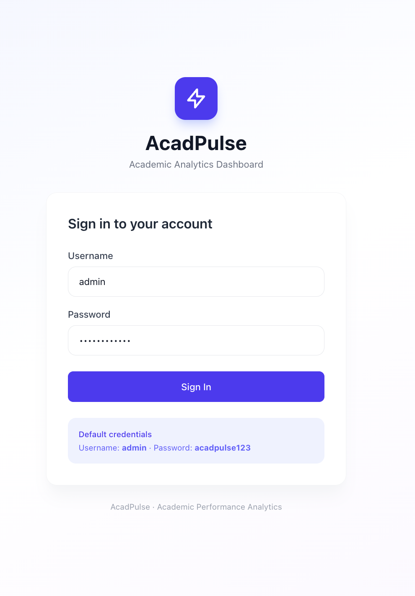
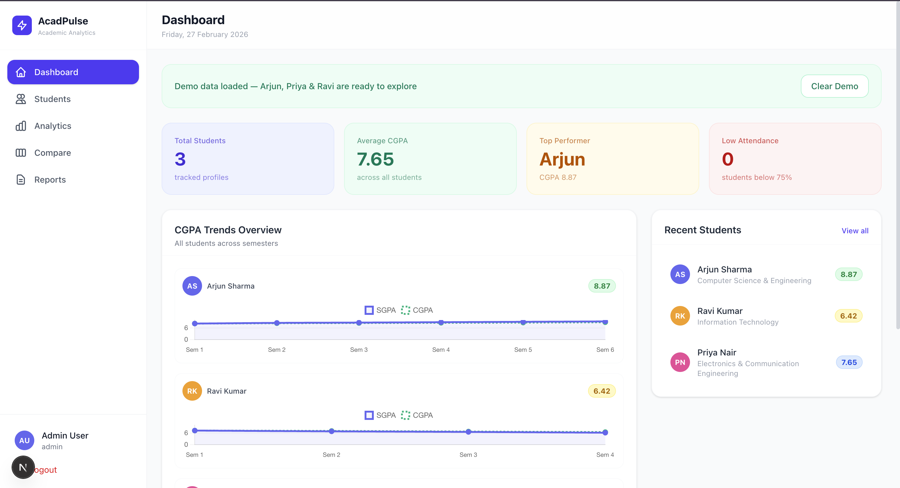
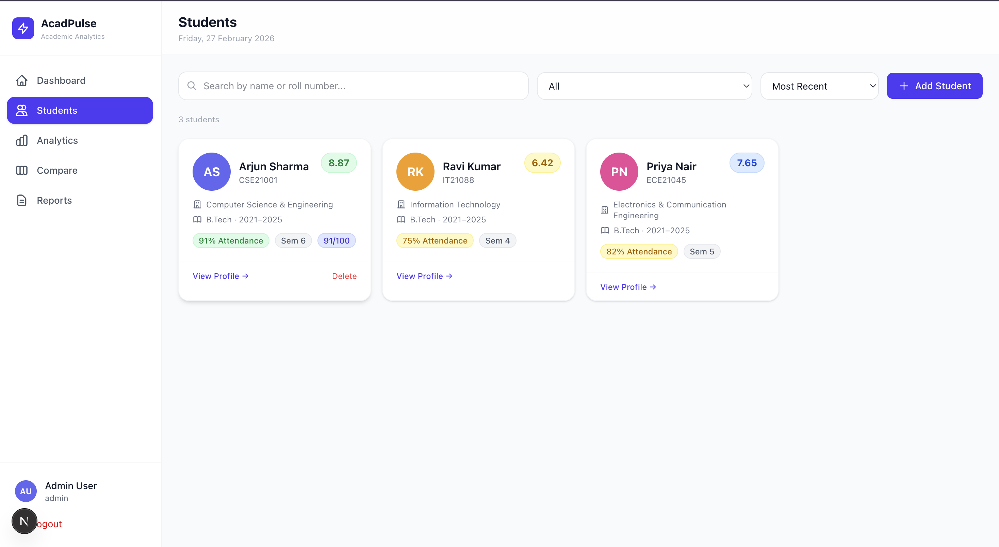
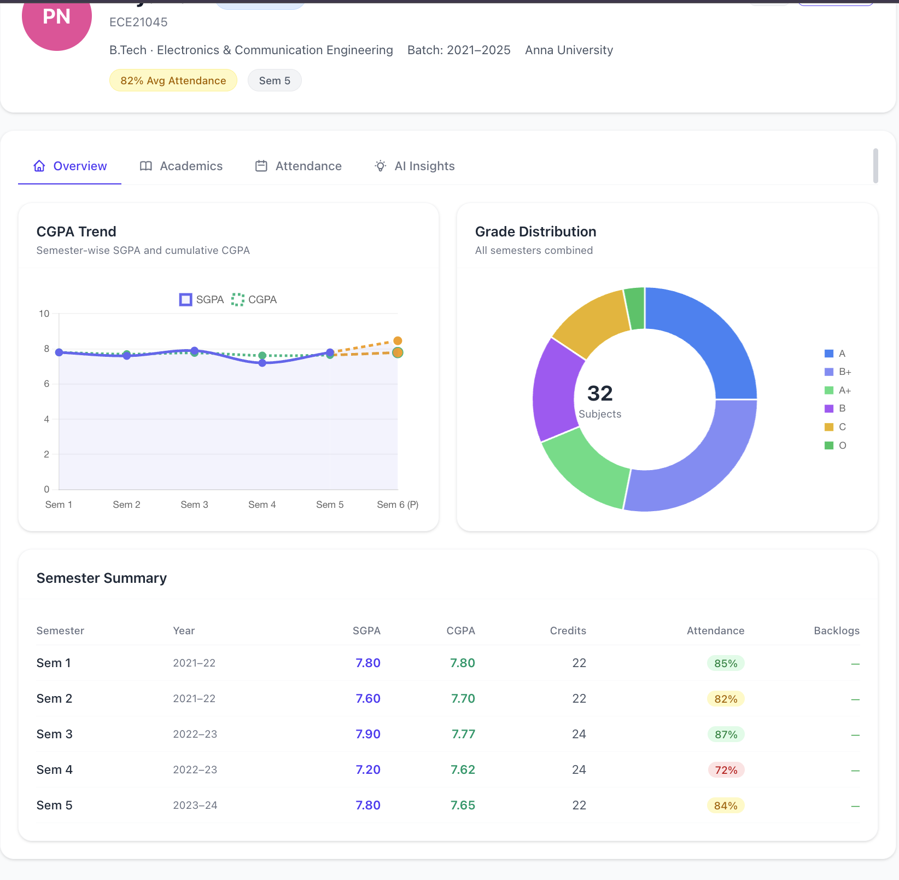
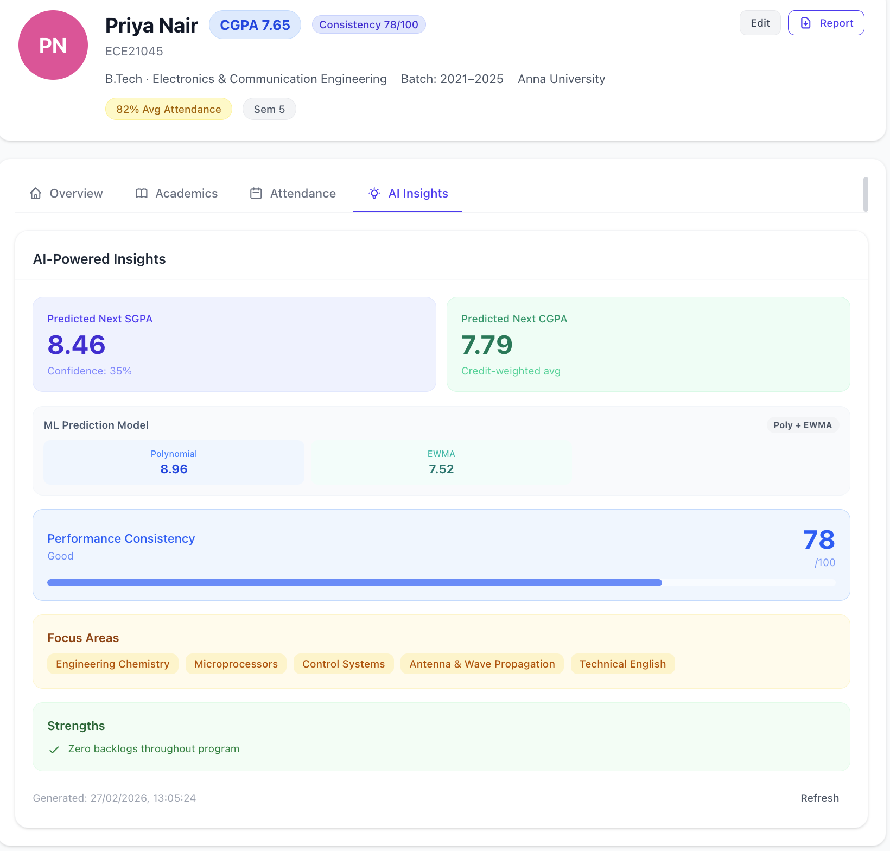
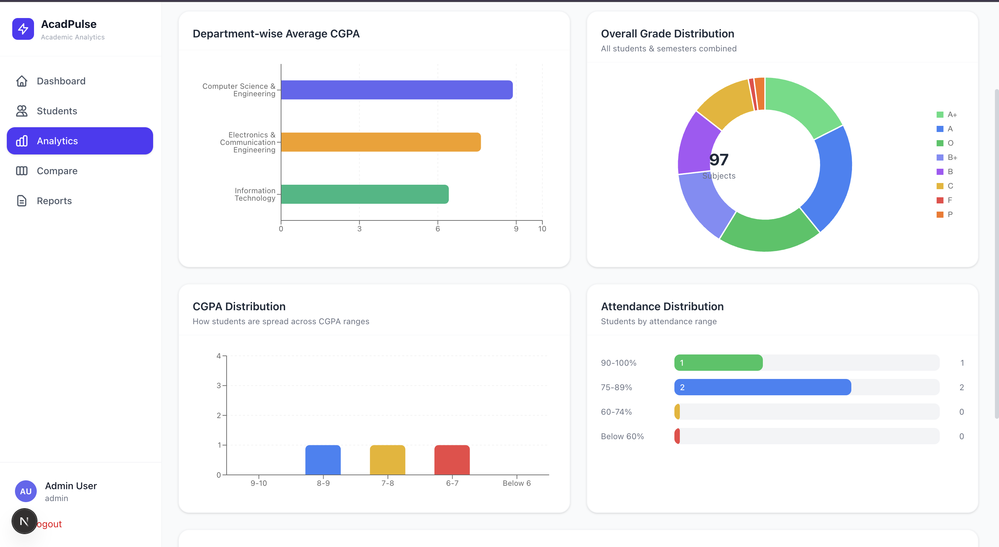
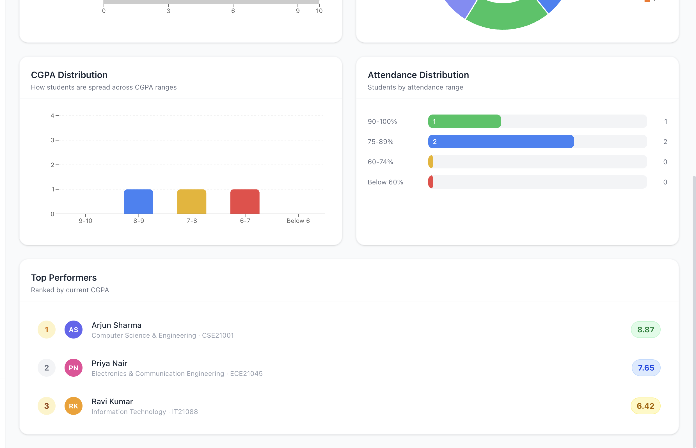
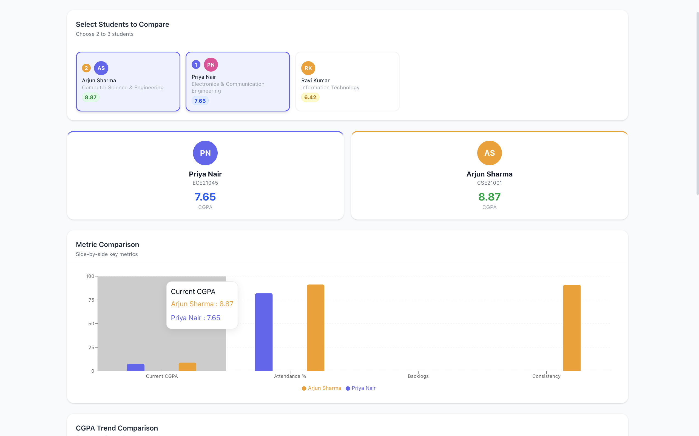
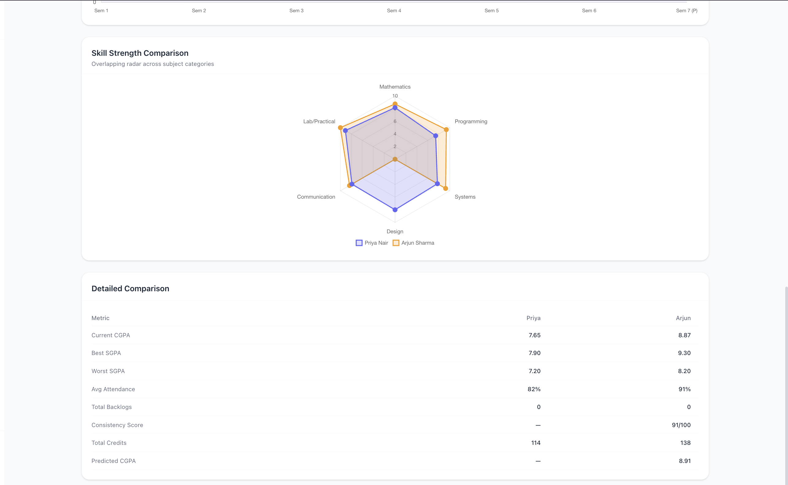
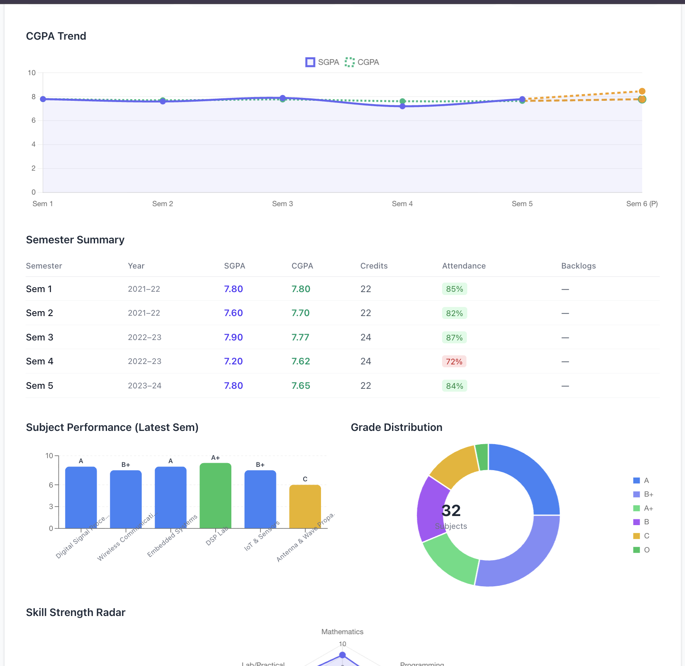

<div align="center">

# ⚡ AcadPulse

### Academic Analytics Dashboard

**Upload marksheets → Get instant CGPA trends, attendance insights, ML-powered predictions, and downloadable reports.**

[](https://nextjs.org/)
[](https://react.dev/)
[](https://www.typescriptlang.org/)
[](https://tailwindcss.com/)
[](https://d3js.org/)
[](https://www.chartjs.org/)
[](LICENSE)

---

> **[▶ Watch Demo Video](#demo-video)** &nbsp;·&nbsp; **[Screenshots](#screenshots)** &nbsp;·&nbsp; **[Quick Start](#quick-start)** &nbsp;·&nbsp; **[Features](#features)**

</div>

---

## Demo Video

<!--
  ──────────────────────────────────────────────────
  HOW TO ADD YOUR DEMO VIDEO
  ──────────────────────────────────────────────────
  1. Record a screen walkthrough (Loom / OBS / QuickTime)
  2. Upload to YouTube or Loom
  3. Uncomment ONE of the options below and replace the ID

  OPTION A — YouTube:
  []([https://www.youtube.com/watch?v=YOUR_VIDEO_ID](https://youtu.be/0_5pEdkNOS0))

  OPTION B — Loom:
  [](https://www.loom.com/share/YOUR_LOOM_ID)
  ──────────────────────────────────────────────────
-->

**Suggested demo script (2–3 min):**
| # | What to show |
|---|---|
| 1 | Open `localhost:3000` → Login screen with pre-filled credentials |
| 2 | Click **Load Demo Data** → dashboard fills with 3 students |
| 3 | Open **Arjun Sharma** → Overview tab (CGPA line + grade pie + semester table) |
| 4 | Switch to **Academics** → show D3 bubble chart hover interactions + radar |
| 5 | Switch to **Attendance** → show Plotly heatmap colors |
| 6 | Switch to **AI Insights** → click Generate → show RF + Poly + EWMA breakdown |
| 7 | Go to **Compare** → select Arjun + Priya + Ravi → radar overlay |
| 8 | Go to **Reports** → select student → Print / Save PDF |

---

## Screenshots

### 🔐 Login

> Clean sign-in screen · SHA-256 password hashing · 7-day auto-expiring sessions · Default credentials shown on screen

---

### 🏠 Dashboard

> At-a-glance stats: 3 students · Average CGPA 7.65 · Top performer Arjun · Low attendance count · Mini CGPA trend charts · Demo data loaded banner

---

### 👥 Students List

> All student cards with CGPA badge, attendance %, semester, consistency score · Search + filter bar · Add Student button

---

### 👤 Student Profile — Overview

> CGPA + SGPA line chart (Sem 1–5 with Sem 6 predicted dashed) · Grade distribution pie (32 subjects) · Full semester summary table with attendance color-coding

---

### 🤖 AI Insights — ML Prediction Panel

> Priya Nair: Predicted SGPA 8.46 · Predicted CGPA 7.79 · Poly + EWMA model breakdown · Consistency 78/100 (Good) · Focus areas: Engineering Chemistry, Microprocessors, Control Systems · Strengths

---

### 📊 Analytics — Department & Grade Overview

> Department-wise avg CGPA horizontal bar chart · Overall grade distribution donut chart (97 subjects combined across all students)

---

### 🏆 Analytics — Distribution & Leaderboard

> CGPA distribution histogram · Attendance distribution by bucket · Top Performers leaderboard: Arjun 8.87 · Priya 7.65 · Ravi 6.42

---

### ⚖️ Compare — Metric Comparison

> Arjun vs Priya selected · Profile header cards with CGPA · Grouped metric bar chart: Current CGPA, Attendance %, Backlogs, Consistency side-by-side with tooltip

---

### 🕸️ Compare — Skill Radar & Detailed Table

> Overlapping radar chart (Priya in blue vs Arjun in orange) across 6 skill categories · Detailed comparison table: Best/Worst SGPA · Avg Attendance · Total Credits · Predicted CGPA

---

### 📄 Report & PDF Export

> Full printable report: CGPA trend chart · Semester summary table · Subject performance bar chart · Grade distribution pie · Skill strength radar · "Print / Save PDF" triggers browser print dialog

---

## Features

<table>
<tr>
<td width="50%">

### 📂 Data Input

- **File upload** — drag & drop PDF marksheets or JPG/PNG images
- **AI extraction** — Claude AI (claude-sonnet-4-6) parses grades, credits, attendance from uploaded files automatically
- **OCR** — Tesseract.js reads scanned/photographed marksheets
- **Manual entry** — add any number of semesters and subjects by hand; SGPA & CGPA are auto-calculated as you type
- **Demo data** — one-click load of 3 complete student profiles

</td>
<td width="50%">

### 📊 6 Chart Types

| Chart | Library | What it shows |
|---|---|---|
| Line chart | Chart.js | CGPA & SGPA semester trend |
| Bar chart | Recharts | Per-subject grade comparison |
| Radar chart | Chart.js | Skill strength by category |
| Pie chart | Chart.js | Grade distribution |
| Heatmap | Plotly.js | Monthly attendance pattern |
| **Bubble chart** | **D3.js** | Attendance vs Grade Point |

</td>
</tr>
<tr>
<td>

### 🤖 ML Prediction Engine

Predicts next semester SGPA + CGPA using a 3-model ensemble:

```
Data  Method                   Max confidence
────  ──────────────────────   ──────────────
N=1   EWMA only                25%
N=2–3 Polynomial + EWMA        60%
N≥4   RF(50%) + Poly(30%)      92%
      + EWMA(20%)
```

**Random Forest features:** prevSGPA · momentum · rollingAvg · attendance · backlogs · CGPA · creditRatio

**Confidence** from Leave-One-Out cross-validation on the RF model. Attendance penalty reduces confidence for students below 75%.

</td>
<td>

### 📈 Performance Consistency Score

Composite score 0–100 measuring how stable performance has been:

| Sub-score | Weight | Measures |
|---|---|---|
| SGPA variance | 40% | Low std deviation → high score |
| Trend direction | 30% | Upward slope → high score |
| Attendance consistency | 20% | High avg + low variability |
| Backlog penalty | 10% | −20 pts per backlog |

**Labels:** Excellent ≥85 · Good ≥65 · Average ≥45 · Inconsistent <45

</td>
</tr>
<tr>
<td>

### ⚖️ Student Comparison

- Select **2 or 3 students** from the picker
- Grouped metric bar chart — CGPA, Attendance, Backlogs, Consistency side-by-side
- **Overlapping radar** — skill polygons for all students on one chart
- Individual CGPA trend charts stacked vertically
- Detailed table: Current CGPA · Best/Worst SGPA · Avg Attendance · Backlogs · Consistency · Predicted CGPA

</td>
<td>

### 📄 PDF Reports

- Full-page report preview rendered in-browser before printing
- Includes: profile cover · CGPA trend chart · subject bar · skill radar · grade pie · AI insights section
- **Print / Save PDF** opens browser's native print dialog
- Works reliably with all charts (no canvas-capture limitations)
- Chrome/Edge: set destination → "Save as PDF"

</td>
</tr>
<tr>
<td>

### 🔐 Authentication

- SHA-256 password hashing via Web Crypto API
- 7-day sessions stored in localStorage with auto-expiry
- Register additional user accounts
- Default: `admin` / `acadpulse123`
- Redirects to login automatically on session expiry

</td>
<td>

### 🧪 Built-in Demo Data

Three realistic students, one click to load:

| Student | Dept | CGPA | Story |
|---|---|---|---|
| Arjun Sharma | CSE | 8.87 | Steady upward trend |
| Priya Nair | ECE | 7.65 | Attendance dip → CGPA drop |
| Ravi Kumar | IT | 6.42 | Declining trend + backlog |

</td>
</tr>
</table>

---

## Quick Start

### Prerequisites

| Tool | Minimum version |
|---|---|
| Node.js | 18 |
| npm | 9 |
| Browser | Chrome / Edge / Firefox / Safari (modern) |

### Step 1 — Clone & Install

```bash
git clone https://github.com/Ruchitha1608/AcadEdu.git
cd AcadEdu
npm install
```

### Step 2 — Environment Variables *(optional)*

Only needed for AI-powered PDF / image extraction:

```bash
# .env.local  (create at project root)
ANTHROPIC_API_KEY=sk-ant-xxxxxxxxxxxx
```

Get a key at [console.anthropic.com](https://console.anthropic.com).
Without it, manual entry and the full ML engine still work.

### Step 3 — Start Dev Server

```bash
npm run dev
```

Open **[http://localhost:3000](http://localhost:3000)**

### Step 4 — Login

```
Username: admin
Password: acadpulse123
```

### Step 5 — Load Demo Data

On the dashboard, click **"Load Demo Data"** to instantly populate 3 complete student profiles — no manual entry needed.

### Production Build

```bash
npm run build
npm start
```

---

## Project Walkthrough

```
┌─ /login
│   └── Sign in  →  admin / acadpulse123
│
├─ /dashboard
│   ├── Load Demo Data  →  seeds 3 students instantly
│   ├── Stats row: Total · Avg CGPA · Top Performer · Low Attendance
│   ├── Mini CGPA trend charts (last 3 updated students)
│   └── Quick Actions: Add Student · Compare · Analytics · Reports
│
├─ /students/new
│   ├── Upload tab: drag & drop PDF or image  →  AI extracts data
│   └── Manual tab: fill profile + semesters + subjects
│
├─ /students/:id  (Student Profile)
│   ├── Overview     CGPA line chart · Grade pie · Semester table
│   ├── Academics    Bar chart · D3 bubble chart · Radar · Subject table
│   ├── Attendance   Heatmap · Stat boxes · Progress bars
│   └── AI Insights  → click "Generate Insights"
│                      Predicted SGPA/CGPA · ML model breakdown
│                      Consistency score · Focus areas · Strengths · Warnings
│
├─ /analytics
│   └── Dept CGPA · Grade dist · CGPA buckets · Attendance buckets · Leaderboard
│
├─ /compare
│   └── Select 2–3 students  →  Metrics · Trends · Radar overlay · Table
│
└─ /reports
    └── Select student  →  Preview  →  "Print / Save PDF"
        (set print destination to "Save as PDF")
```

---

## Project Structure

```
src/
├── app/
│   ├── (auth)/login/              Login page
│   ├── (dashboard)/
│   │   ├── dashboard/             Home dashboard
│   │   ├── students/[id]/         Student profile (4 tabs)
│   │   ├── compare/               Multi-student comparison
│   │   ├── analytics/             Aggregate analytics
│   │   └── reports/               PDF report generator
│   └── api/
│       ├── ai-insights/           ML insights endpoint
│       └── extract-pdf/           Claude AI extraction endpoint
│
├── components/
│   ├── charts/
│   │   ├── CGPATrendChart.tsx     Chart.js line
│   │   ├── SubjectBarChart.tsx    Recharts bar
│   │   ├── SkillRadarChart.tsx    Chart.js radar
│   │   ├── GradeDistributionPie.tsx  Chart.js pie
│   │   ├── AttendanceHeatmap.tsx  Plotly heatmap
│   │   ├── SubjectBubbleChart.tsx D3.js bubble  ← D3 chart
│   │   └── ComparisonChart.tsx    Recharts grouped bar
│   ├── student/                   StudentCard · AIInsightsPanel
│   ├── upload/                    FileUploadZone · ManualEntryForm
│   └── ui/                        Button · Card · Badge · Avatar · Tabs
│
├── lib/
│   ├── predictions.ts             ML engine (RF + Polynomial + EWMA)
│   ├── consistency.ts             Consistency score formula
│   ├── chartTransformers.ts       Data → chart format converters
│   ├── reportGenerator.ts         Print-to-PDF logic
│   ├── demoData.ts                3 built-in demo students
│   ├── storage.ts                 localStorage CRUD
│   └── auth.ts                    Login · register · session
│
├── hooks/
│   ├── useStudents.ts
│   └── useAuth.ts
│
└── types/
    ├── student.ts                 Student · Semester · Subject · AIInsights
    └── chart.ts                   Chart data point types
```

---

## Grade System (10-point scale)

| Grade | Points | Level |
|---|---|---|
| O | 10.0 | Outstanding |
| A+ | 9.0 | Excellent |
| A | 8.5 | Very Good |
| B+ | 8.0 | Good |
| B | 7.0 | Above Average |
| C | 6.0 | Average |
| P | 5.0 | Pass |
| F / Ab / W | 0.0 | Fail / Absent / Withheld |

**SGPA** = Σ(grade points × credits) / Σ(credits)

**CGPA** = Σ(SGPA × semester credits) / Σ(all semester credits)

---

## Full Documentation

See **[DOCUMENTATION.md](DOCUMENTATION.md)** for deep dives into:
- ML prediction internals — EWMA math, RF features & hyperparameters, ensemble weights
- Consistency score formula with full sub-score breakdown
- Complete TypeScript data model interfaces
- API route request / response formats
- localStorage architecture and backup instructions

---

## Contributing

```bash
# 1. Fork the repo and create a branch
git checkout -b feat/your-feature

# 2. Make changes and commit
git commit -m "feat: describe your change"

# 3. Push and open a Pull Request
git push origin feat/your-feature
```

---

## License

MIT © 2024 [Ruchitha1608](https://github.com/Ruchitha1608)

---

<div align="center">

Made with Next.js · D3.js · Chart.js · Recharts · Plotly · Tailwind CSS · Claude AI

</div>
